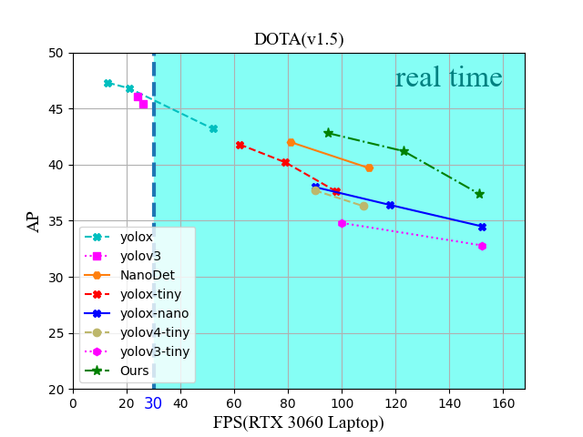

# SMOD-YOLO

SMOD-YOLO is a lightweight model for small object detection.



## Download

```bash
$ git clone https://github.com/painlove1999/SMOD-YOLO
```

## Train

***The training process is referred to yolov5, and we increased the weight of PL-YOLO on the Dota dataset***

```bash
python train.py --data data/DOTA.yaml --cfg models/PL-YOLO.yaml --weights 'weights/SMOD-YOLO.pt' --batch-size 1                                                                                                18                                                                                              32
```

## Inference 

```bash
python detect.py --source 0  # webcam    
                          img.jpg  # image
                          vid.mp4  # video
                          path/  # directory
                          path/data/images  # glob
                          'https://youtu.be/Zgi9g1ksQHc'  # YouTube
                          'rtsp://example.com/media.mp4'  # RTSP, RTMP, HTTP stream
```

## Results

**We compare the results with other state-of-the-art end-to-end object detectors and show the results for the Dota dataset(@1024x1024)**

| Method         | **Params(M)** | **GFLOPs** | **FPS@RTX 3060** | AP    | AP50  | AP75  |
| ------- | ---- | ---- | ------- | ---- | ---- | ---- |
| **YOLOXl**     | 54.16 | 155.6 | 13 | 47.3% | 71.3% | 49.6% |
| **YOLOXm**     | 25.29 | 73.8 | 21 | 46.8% | 70.7% | 47.9% |
| **YOLOXs**     | 8.94 | 26.8 | 52 | 43.2% | 67.7% | 46.1% |
| **YOLOX-tiny** | 5.04 | 15.16 | 66 | 41.8% | 66.0% | 44.5% |
| **YOLOX-Nano** | 2.24 | 6.89 | 91 | 38.0% | 62.1% | 38.8% |
| **YOLOv4-p6** | 126.8 | 178.3 | 14 | 48.5% | 72.7% | 52.8% |
| **YOLOv4-p5** | 70.3 | 156.7 | 20 | 48.0% | 72.1% | 51.0% |
| **YOLOv4-csp** | 52.57 | 119.5 | 26 | 47.8% | 71.4% | 51.9% |
| **YOLOv3** | 61.59 | 155.3 | 25 | 45.4% | 70.5% | 47.1% |
| **YOLOv3-spp** | 62.64 | 156.2 | 24 | 46.1% | 71.0% | 47.9% |
| **YOLOv4-tiny** | 6.15 | 19.2 | 90 | 37.7% | 61.0% | ---- |
| **YOLOv3-tiny** | 8.70 | 13.0 | 100 | 34.8% | 58.2% | ---- |
| **SMOD-YOLO** | **4.87** | **11.3** | **95** | **42.8%** | **67.6%** | **45.6%** |


## Acknowledgements


+ [https://github.com/ultralytics/yolov5](https://github.com/ultralytics/yolov5)

